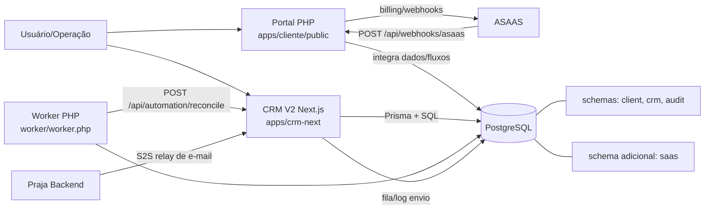

# Arquitetura

Status: Em validação  
Última revisão: 2026-04-18  
Fonte principal: `docker-compose.yml` + `database/init/*.sql` + `apps/crm-next/prisma/schema.prisma` + `apps/cliente/public/index.php` + `worker/worker.php`

## Arquitetura técnica atual (confirmada)

## Componentes principais
| Componente | Caminho | Papel | Status |
|---|---|---|---|
| Portal cliente | `apps/cliente/public/index.php` | UI + APIs do portal (auth, billing, briefing, tickets, webhook) | Confirmado |
| CRM V2 | `apps/crm-next` | UI CRM + APIs operacionais/comerciais | Confirmado |
| Shared PHP | `apps/shared/src` | infraestrutura comum (db, request/response, ASAAS, auth) | Confirmado |
| Worker | `worker/worker.php` | rotinas recorrentes, reconciliação e processamento assíncrono | Confirmado |
| Banco bootstrap | `database/init/*.sql` | criação inicial de schemas/tabelas | Confirmado |
| Migrações SQL | `database/migrations/*.sql` | evolução incremental de estrutura | Confirmado |

## Distinção entre implementado e planejado
### Confirmado no código
- arquitetura portal + CRM + worker + banco compartilhado
- integrações pontuais implementadas (ASAAS, relay e-mail, Freelas, Instagram)

### Planejado (documentado, não confirmado como runtime completo)
- arquitetura de integrações v2.5.0 orientada a eventos, multi-tenant, com DLQ e componentes dedicados (`event_dispatcher`, `queue_processor`, `integration_manager`, etc.)

### Incerteza encontrada
- não há evidência de todos os componentes v2.5.0 como plataforma única já ativa no runtime atual.

### Precisa validação
- cronograma oficial de adoção da arquitetura v2.5.0 e estratégia de migração a partir do estado atual.
