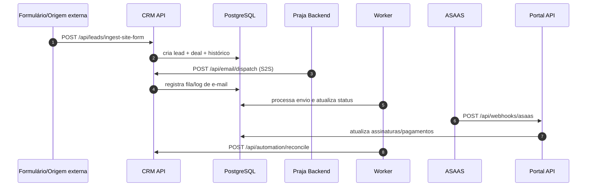

# Integrações

Status: Em validação  
Última revisão: 2026-04-18  
Fonte principal: `docs/archive/API_CONTRACT.md` + `docs/archive/API_EMAIL_RELAY_PRAJA.md` + `apps/crm-next/app/api/*` + `apps/shared/src/Support/AsaasWebhookProcessor.php`

## Integrações implementadas (confirmadas)
| Integração | Endpoint/caminho | Dono no repositório | Status |
|---|---|---|---|
| ASAAS webhook | `POST /api/webhooks/asaas` (portal) | `apps/cliente/public/index.php` + `apps/shared/src/Support/AsaasWebhookProcessor.php` | Confirmado |
| Ingestão de lead de site | `POST /api/leads/ingest-site-form` (CRM) | `apps/crm-next/app/api/leads/ingest-site-form/route.ts` | Confirmado |
| Relay de e-mail Praja -> CRM | `GET /api/email/templates/resolve`, `POST /api/email/dispatch` | `apps/crm-next/app/api/email/*` + `apps/crm-next/lib/email-relay.ts` | Confirmado |
| Reconciliação operacional | `POST /api/automation/reconcile` | `apps/crm-next/app/api/automation/reconcile/route.ts` | Confirmado |
| Integração Freelas/n8n | `api/integrations/freelas/tickets*` | `apps/crm-next/app/api/integrations/freelas/*` | Confirmado |
| Integração social Instagram (Meta) | `api/social/instagram/*` | `apps/crm-next/app/api/social/instagram/*` | Confirmado |

## Fluxo principal de integração (estado atual)

## Segurança e autenticação (resumo operacional)
### Confirmado no código
- APIs administrativas do CRM usam cookie `crm_admin_session`
- endpoints de integração aceitam token de integração em fluxos específicos (`x-crm-integration-token`)
- relay de e-mail aceita autenticação S2S com `x-api-key` e/ou bearer (`CRM_S2S_*`), com fallback de compatibilidade
- webhook ASAAS valida token quando `ASAAS_WEBHOOK_TOKEN` está configurado

## Planejado vs implementado
### Planejado (não tratar como produção atual)
- `docs/archive/KODDACRM_MODULO_INTEGRACOES_v2.5.0.md` descreve plataforma orientada a eventos com multi-tenant, DLQ, dispatcher e webhook handler genérico.

### Confirmado no código atual
- integrações existem, mas com implementação distribuída nos endpoints e serviços do CRM/portal/worker.

## Incertezas de fronteira de ecossistema
### Incerteza encontrada
- a divisão formal de responsabilidade entre este repositório e sistemas externos do ecossistema não está totalmente especificada em contratos versionados dentro deste repositório.

### Hipótese atual
- este repositório opera o CRM e o portal do cliente, recebendo integrações externas e disparando ações operacionais.

### Precisa validação
- fronteira canônica com KoddaProspect e demais serviços para ciclo completo de lead/enriquecimento/campanha.
