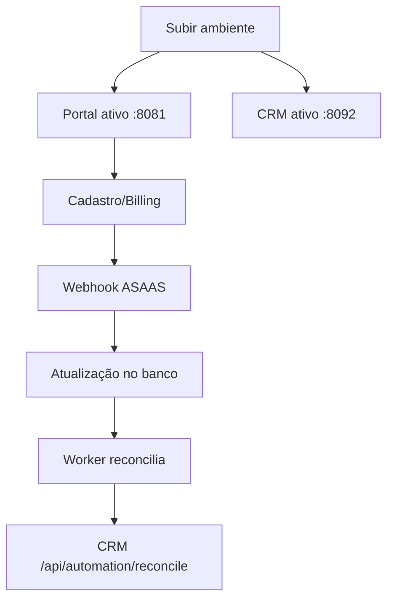

# Operação

Status: Atual  
Última revisão: 2026-04-18  
Fonte principal: `docker-compose.yml` + `scripts/up.sh` + `script/deploy.sh` + `.env.example`

## Ambiente e dependências
- Docker + Docker Compose
- Arquivo `.env` baseado em `.env.example`
- Serviços principais: portal PHP, nginx, CRM Next.js, PostgreSQL, Redis, worker

## Execução local
```bash
cd /home/server/projects/projeto-area-cliente
cp .env.example .env
./scripts/up.sh
```

## Portas atuais (docker-compose)
| Serviço | Porta host | Container |
|---|---|---|
| Portal (Nginx) | `8081` | `ac_nginx_cliente:80` |
| CRM V2 | `8092` | `ac_crm_next:3000` |
| Postgres | `5434` | `ac_postgres:5432` |
| Redis | `6381` | `ac_redis:6379` |
| Preview estático | `8085` | `ac_preview:80` |

## Deploy operacional
```bash
cd /home/server/projects/projeto-area-cliente
./script/deploy.sh
```

Opções suportadas:
```bash
./script/deploy.sh --skip-pull
./script/deploy.sh --with-seed
```

## Fluxo operacional crítico (resumo)


## Troubleshooting mínimo
- verificar containers: `docker ps`
- logs CRM: `docker logs --tail 200 ac_crm_next`
- logs worker: `docker logs --tail 200 ac_worker`
- health CRM: `curl -I http://localhost:8092/api/health`
- portal: `curl -I http://localhost:8081/login`

## Incertezas e divergências documentais
### Incerteza encontrada
- docs antigos citavam `./deploy.sh` na raiz; arquivo real validado: `script/deploy.sh`.
- `.env.example` ainda traz `APP_URL_CRM=http://192.168.25.3:8082`, mas o compose expõe CRM em `8092`.

### Precisa validação
- alinhar valores de URL/porta em todos os pontos de documentação operacional.
