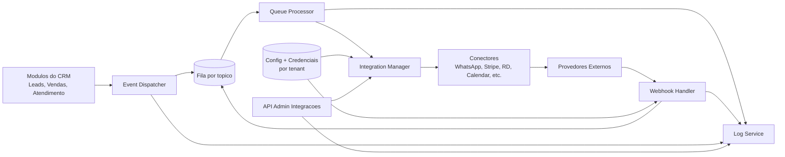
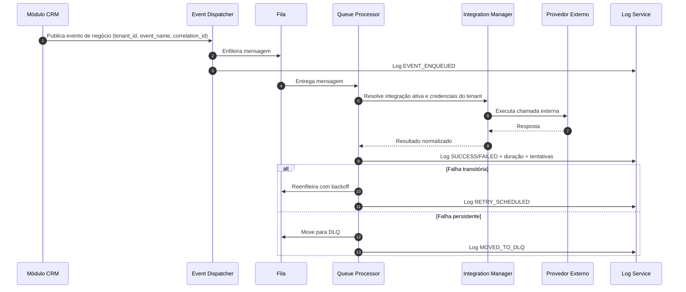
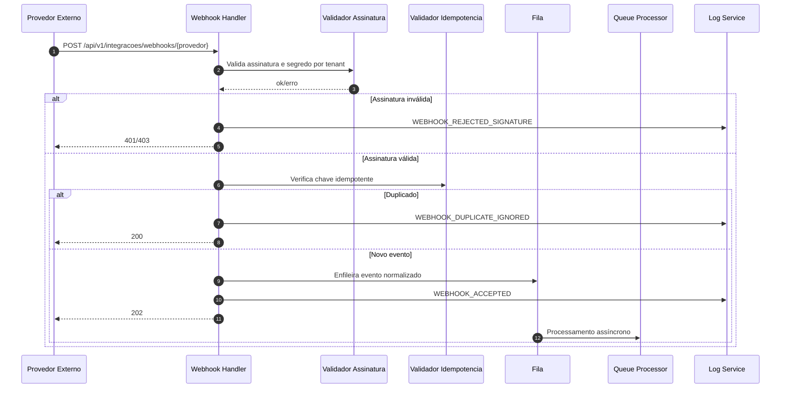
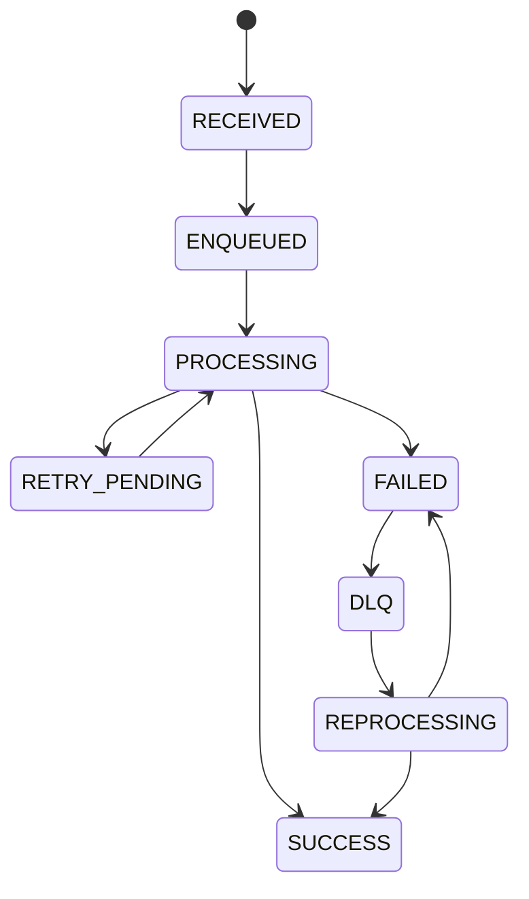
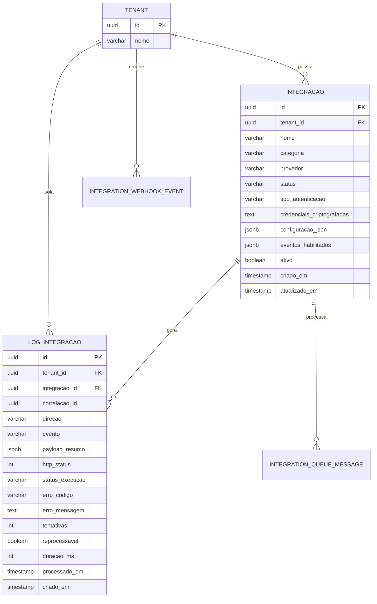
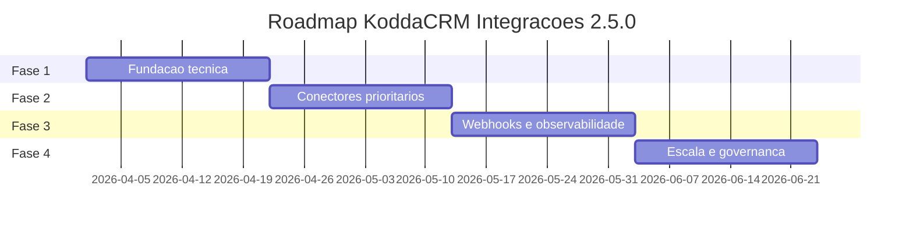

# KoddaCRM - Documentação Técnica do Módulo de Integrações (v2.5.0)

## Metadados

| Campo | Valor |
|------ |---|
| Sistema | KoddaCRM |
| Módulo | Integrações |
| Tipo de atualização | Evolutiva |
| Versão atual | 2.4.0 |
| Nova versão | 2.5.0 |
| Data da atualização | 2026-03-29 |
| Responsável | Time de Arquitetura KoddaHub |
| Status | Planejada |

---

## 1. Visão Geral

O módulo de Integrações do KoddaCRM será evoluído para um modelo orientado a eventos, com processamento assíncrono, isolamento por tenant, rastreabilidade ponta a ponta e controles robustos de segurança para credenciais.

A versão **2.5.0** formaliza um padrão único para conectores externos (comunicação, pagamentos, marketing, atendimento, produtividade e APIs), reduzindo acoplamento entre domínios internos e aumentando previsibilidade operacional.

---

## 2. Objetivo da Atualização

### 2.1 Título
**Expansão e padronização do módulo de integrações**

### 2.2 Descrição
Evoluir o módulo de Integrações do KoddaCRM para um modelo orientado a eventos, com execução assíncrona, isolamento por tenant, segurança de credenciais e rastreabilidade completa das operações com serviços externos.

### 2.3 Benefícios Esperados

- Aumentar a capacidade de conexão com provedores externos de forma padronizada.
- Reduzir acoplamento entre módulos internos por meio de eventos.
- Melhorar resiliência com filas, retentativas e reprocessamento de falhas.
- Elevar segurança no tráfego e armazenamento de dados sensíveis.
- Escalar horizontalmente os processamentos de integração.
- Garantir auditoria e rastreabilidade fim a fim por tenant.

---

## 3. Escopo

### 3.1 Escopo funcional da versão 2.5.0

- Plataforma base multi-tenant de integrações.
- Cadastro seguro de conectores e credenciais por tenant.
- Dispatcher de eventos internos para filas de integração.
- Processamento assíncrono com retentativa e DLQ.
- Recebimento de webhooks com assinatura, idempotência e roteamento.
- Logs técnicos e funcionais com correlação e auditoria.
- API interna para administração de integrações e consulta de logs.

### 3.2 Escopo por categoria de integração

| Categoria | Integrações | Prioridade | Status |
|---|---|---|---|
| Comunicação | WhatsApp API, SMTP Transacional | Alta, Média | Planejada |
| Vendas e Pagamentos | Stripe, Gateway PIX | Alta, Média | Planejada |
| Marketing | RD Station, Meta Ads | Alta, Média | Planejada |
| Atendimento | Plataforma Help Desk, Chat Omnichannel | Média, Média | Planejada |
| Produtividade | Google Calendar, Google Drive | Alta, Baixa | Planejada |
| Webhooks e APIs | Webhook de Entrada, API Pública de Integrações | Alta, Alta | Planejada |

### 3.3 Fora de escopo imediato (2.5.0)

- Marketplace self-service de conectores de terceiros.
- Billing de uso por conector/evento em tempo real.
- Motor avançado de transformação low-code visual.

---

## 4. Arquitetura

### 4.1 Modelo arquitetural
**Arquitetura orientada a eventos com processamento assíncrono e isolamento multi-tenant.**

### 4.2 Diagrama de componentes (alto nível)



### 4.3 Diagrama de sequência - evento de saída



### 4.4 Diagrama de sequência - webhook de entrada



### 4.5 Princípios de isolamento multi-tenant

- Todas as entidades possuem `tenant_id` obrigatório.
- Chaves de autenticação/API Key possuem escopo por tenant.
- Segredos e tokens são segregados por tenant e provedor.
- Logs e consultas administrativas sempre filtram por tenant.
- Reprocessamento somente no contexto do tenant de origem.

---

## 5. Componentes

| ID | Componente | Função principal | Entradas | Saídas |
|---|---|---|---|---|
| `integration_manager` | Integration Manager | Gerenciar ciclo de vida, credenciais e configuração de conectores por tenant | Configuração, credenciais, políticas | Definição de execução do conector |
| `event_dispatcher` | Event Dispatcher | Publicar eventos de negócio nas filas de integração | Eventos internos do CRM | Mensagens enfileiradas com correlação |
| `queue_processor` | Queue Processor | Consumir mensagens, acionar provedores, aplicar retentativas | Mensagens da fila | Resultado de integração + logs |
| `webhook_handler` | Webhook Handler | Receber webhooks, validar assinatura/idempotência e rotear | HTTP externo | Mensagens normalizadas para fila |
| `log_service` | Log Service | Centralizar rastreabilidade técnica e funcional | Eventos de execução e erros | Auditoria e observabilidade |

---

## 6. Fluxo Operacional

### 6.1 Fluxo resumido

1. Evento interno é gerado no módulo de origem com contexto do tenant.
2. Event Dispatcher publica o evento em fila dedicada por tipo de integração.
3. Queue Processor consome a mensagem e aciona o conector configurado no Integration Manager.
4. Resultado da chamada externa é persistido no Log Service com correlação e status de execução.
5. Em falha temporária, evento entra em retentativa; em falha persistente, vai para DLQ/reprocessamento.

### 6.2 Estados de execução



### 6.3 Política padrão de retentativa

| Item | Valor sugerido |
|---|---|
| Tentativas máximas | 5 |
| Backoff | Exponencial com jitter |
| Timeout por chamada externa | 10s (ajustável por provedor) |
| Destino após falha persistente | DLQ (`integration.dead-letter`) |
| Reprocessamento manual | Permitido via endpoint administrativo |

---

## 7. Integrações Previstas

| Integração | Categoria | Objetivo | Ações principais | Eventos de disparo | Status |
|---|---|---|---|---|---|
| WhatsApp API | Comunicação | Automatizar envio de mensagens e registrar interações | `enviar_mensagem`, `consultar_status_mensagem`, `receber_mensagem` | `lead_criado`, `negocio_atualizado`, `ticket_aberto` | Planejada |
| Google Calendar | Produtividade | Sincronizar compromissos e lembretes | `criar_evento`, `atualizar_evento`, `cancelar_evento` | `reuniao_agendada`, `reuniao_reagendada`, `reuniao_cancelada` | Planejada |
| Stripe | Vendas e Pagamentos | Processar cobranças e refletir status no CRM | `criar_cobranca`, `capturar_pagamento`, `consultar_fatura` | `assinatura_criada`, `fatura_vencida`, `pagamento_confirmado` | Planejada |
| RD Station | Marketing | Sincronizar leads e conversões | `enviar_lead`, `atualizar_segmentacao`, `registrar_conversao` | `lead_qualificado`, `campanha_ativada`, `oportunidade_ganha` | Planejada |
| SMTP Transacional | Comunicação | Disparo de notificações e campanhas operacionais | `enviar_email`, `consultar_status` | `notificacao_disparo`, `campanha_operacional` | Planejada |
| Gateway PIX | Vendas e Pagamentos | Recebimentos instantâneos e reconciliação | `gerar_cobranca_pix`, `consultar_pagamento` | `cobranca_criada`, `pagamento_confirmado` | Planejada |
| Meta Ads | Marketing | Importar conversões e atribuição | `registrar_conversao`, `sincronizar_campanha` | `lead_convertido`, `oportunidade_ganha` | Planejada |
| Help Desk | Atendimento | Abertura e sincronização de tickets | `abrir_ticket`, `atualizar_status` | `ticket_aberto`, `ticket_atualizado` | Planejada |
| Chat Omnichannel | Atendimento | Centralização de histórico de interação | `registrar_interacao`, `consultar_historico` | `mensagem_recebida`, `ticket_aberto` | Planejada |
| Google Drive | Produtividade | Gerir anexos em fluxos comerciais/operacionais | `upload_arquivo`, `compartilhar_arquivo` | `documento_gerado`, `proposta_enviada` | Planejada |

---

## 8. Requisitos

### 8.1 Requisitos Funcionais

| ID | Título | Descrição | Prioridade | Obrigatório | Status |
|---|---|---|---|---|---|
| RF-001 | Cadastro seguro de credenciais | Cadastro e atualização de credenciais por tenant com criptografia e RBAC | Alta | Sim | Planejada |
| RF-002 | Mapeamento de eventos por integração | Configurar eventos internos por integração, com filtros | Alta | Sim | Planejada |
| RF-003 | Logs com rastreabilidade | Registrar requisições, respostas, códigos de erro e correlação por tenant | Alta | Sim | Planejada |
| RF-004 | Reprocessamento de falhas | Reprocessamento manual e automático com política de retentativa | Alta | Sim | Planejada |
| RF-005 | Configuração por tenant | Isolamento total de configuração, credenciais e limites por tenant | Alta | Sim | Planejada |
| RF-006 | Webhook configurável | Endpoints com assinatura, segredo por tenant e idempotência | Alta | Sim | Planejada |
| RF-007 | Teste de conectividade | Validar conexão com provedor antes da ativação | Média | Sim | Planejada |
| RF-008 | Execução assíncrona | Processar integrações via filas sem bloquear fluxos críticos | Alta | Sim | Planejada |

### 8.2 Requisitos Não Funcionais

| ID | Título | Descrição |
|---|---|---|
| RNF-001 | Segurança | Credenciais criptografadas em repouso, HTTPS obrigatório e mascaramento em logs |
| RNF-002 | Escalabilidade | Processamento distribuído em filas com escala horizontal |
| RNF-003 | Observabilidade | Logs estruturados, métricas técnicas e alertas proativos |
| RNF-004 | Disponibilidade | Retentativas, circuit breaker e tolerância a falhas de provedores |
| RNF-005 | Performance | Tempo médio de enfileiramento de evento interno menor que 300 ms |

---

## 9. Regras de Negócio

| ID | Regra |
|---|---|
| RN-001 | Toda integração deve passar por validação obrigatória de credenciais antes da ativação |
| RN-002 | Dados, configurações e logs devem permanecer isolados por tenant, sem compartilhamento cruzado |
| RN-003 | Falha de provedor externo não pode bloquear fluxo principal do CRM; evento deve ser enfileirado para retentativa |
| RN-004 | Webhooks recebidos devem aplicar idempotência por chave única de evento |
| RN-005 | Logs devem mascarar dados sensíveis e nunca persistir credenciais em texto puro |
| RN-006 | Reprocessamentos devem registrar usuário, timestamp e motivo para auditoria |

---

## 10. Modelo de Dados

### 10.1 Entidades principais

#### `integracao`
Cadastro de conectores por tenant.

| Campo | Tipo | Obrigatório | Observação |
|---|---|---|---|
| `id` | `uuid` | Sim | PK |
| `tenant_id` | `uuid` | Sim | Escopo multi-tenant |
| `nome` | `varchar(120)` | Sim | Nome amigável |
| `categoria` | `varchar(60)` | Sim | Comunicação, Marketing etc. |
| `provedor` | `varchar(80)` | Sim | Ex.: `stripe`, `rd_station` |
| `status` | `varchar(20)` | Sim | `draft`, `active`, `inactive`, `error` |
| `tipo_autenticacao` | `varchar(30)` | Sim | `api_key`, `oauth2`, `jwt` |
| `credenciais_criptografadas` | `text` | Sim | Ciphertext + metadata |
| `configuracao_json` | `jsonb` | Sim | Configuração operacional |
| `eventos_habilitados` | `jsonb` | Sim | Lista de eventos habilitados |
| `webhook_url` | `varchar(255)` | Não | URL externa se aplicável |
| `ativo` | `boolean` | Sim | Flag de ativação |
| `criado_em` | `timestamp` | Sim | Auditoria |
| `atualizado_em` | `timestamp` | Sim | Auditoria |

#### `log_integracao`
Registro técnico e funcional das execuções.

| Campo | Tipo | Obrigatório | Observação |
|---|---|---|---|
| `id` | `uuid` | Sim | PK |
| `tenant_id` | `uuid` | Sim | Escopo multi-tenant |
| `integracao_id` | `uuid` | Sim | FK para integração |
| `correlacao_id` | `uuid` | Sim | Trace fim a fim |
| `direcao` | `varchar(20)` | Sim | `outbound` ou `inbound` |
| `evento` | `varchar(100)` | Sim | Evento de negócio/técnico |
| `payload_resumo` | `jsonb` | Não | Dados mascarados |
| `http_status` | `integer` | Não | Status de resposta externa |
| `status_execucao` | `varchar(20)` | Sim | `success`, `retry`, `failed`, `dlq` |
| `erro_codigo` | `varchar(50)` | Não | Código normalizado |
| `erro_mensagem` | `text` | Não | Mensagem sanitizada |
| `tentativas` | `integer` | Sim | Tentativas acumuladas |
| `reprocessavel` | `boolean` | Sim | Elegível para retry manual |
| `duracao_ms` | `integer` | Não | Latência da execução |
| `processado_em` | `timestamp` | Não | Quando finalizou |
| `criado_em` | `timestamp` | Sim | Quando registrou |

### 10.2 Entidades complementares recomendadas

| Entidade | Objetivo |
|---|---|
| `integration_event` | Armazenar envelope de evento interno publicado |
| `integration_queue_message` | Controle de tentativas/backoff e estado da fila |
| `integration_webhook_event` | Registro bruto + hash/chave idempotente de webhook |
| `integration_secret_rotation` | Histórico de rotação de segredos/tokens |
| `integration_audit_action` | Auditoria de ativação, desativação e reprocessamento |

### 10.3 Diagrama ER simplificado



### 10.4 Exemplo JSON - integração

```json
{
  "id": "9b45980c-1f0c-4fbc-a38d-80eca9d5f06c",
  "tenant_id": "f7d03268-5ea9-4cc4-b2fd-9588d87fd8f3",
  "nome": "Stripe Principal",
  "categoria": "Vendas e Pagamentos",
  "provedor": "stripe",
  "status": "active",
  "tipo_autenticacao": "api_key",
  "credenciais_criptografadas": "enc:v1:...",
  "configuracao_json": {
    "environment": "sandbox",
    "timeout_ms": 10000,
    "max_retries": 5
  },
  "eventos_habilitados": [
    "assinatura_criada",
    "fatura_vencida",
    "pagamento_confirmado"
  ],
  "webhook_url": "https://crm.koddahub.com/api/v1/integracoes/webhooks/stripe",
  "ativo": true,
  "criado_em": "2026-03-29T10:00:00Z",
  "atualizado_em": "2026-03-29T10:05:00Z"
}
```

### 10.5 Exemplo JSON - log de integração

```json
{
  "id": "7b6e6f34-a2ff-4b67-8290-04a617f3fd55",
  "tenant_id": "f7d03268-5ea9-4cc4-b2fd-9588d87fd8f3",
  "integracao_id": "9b45980c-1f0c-4fbc-a38d-80eca9d5f06c",
  "correlacao_id": "f57d77b0-fb8f-4e0a-8cc2-f5c526437d28",
  "direcao": "outbound",
  "evento": "pagamento_confirmado",
  "payload_resumo": {
    "invoice_id": "in_123",
    "customer_id": "cus_123"
  },
  "http_status": 200,
  "status_execucao": "success",
  "erro_codigo": null,
  "erro_mensagem": null,
  "tentativas": 1,
  "reprocessavel": false,
  "duracao_ms": 432,
  "processado_em": "2026-03-29T11:10:00Z",
  "criado_em": "2026-03-29T11:10:00Z"
}
```

---

## 11. Endpoints

### 11.1 Endpoints internos sugeridos

| Método | Rota | Descrição |
|---|---|---|
| `GET` | `/api/v1/tenants/{tenant_id}/integracoes` | Listar integrações do tenant com filtros |
| `POST` | `/api/v1/tenants/{tenant_id}/integracoes` | Cadastrar integração e validar credenciais |
| `PUT` | `/api/v1/tenants/{tenant_id}/integracoes/{integracao_id}` | Atualizar configuração/eventos/status |
| `DELETE` | `/api/v1/tenants/{tenant_id}/integracoes/{integracao_id}` | Remover ou desativar integração |
| `POST` | `/api/v1/tenants/{tenant_id}/integracoes/{integracao_id}/teste` | Teste de conectividade/credenciais |
| `GET` | `/api/v1/tenants/{tenant_id}/integracoes/logs` | Consultar logs com filtros |
| `POST` | `/api/v1/integracoes/webhooks/{provedor}` | Receber webhook externo com assinatura |

### 11.2 Contrato de erro padrão

```json
{
  "ok": false,
  "error": {
    "code": "INTEGRATION_AUTH_INVALID",
    "message": "Credenciais inválidas para o provedor",
    "correlation_id": "f57d77b0-fb8f-4e0a-8cc2-f5c526437d28",
    "details": {
      "provider": "stripe",
      "tenant_id": "f7d03268-5ea9-4cc4-b2fd-9588d87fd8f3"
    }
  }
}
```

### 11.3 Exemplo - criar integração

**Request**

```http
POST /api/v1/tenants/f7d03268-5ea9-4cc4-b2fd-9588d87fd8f3/integracoes
Authorization: Bearer <jwt>
Content-Type: application/json
```

```json
{
  "nome": "WhatsApp Comercial",
  "categoria": "Comunicacao",
  "provedor": "whatsapp_api",
  "tipo_autenticacao": "api_key",
  "credenciais": {
    "api_key": "***"
  },
  "configuracao": {
    "timeout_ms": 10000,
    "max_retries": 5
  },
  "eventos_habilitados": [
    "lead_criado",
    "ticket_aberto"
  ]
}
```

**Response (201)**

```json
{
  "ok": true,
  "data": {
    "id": "9b45980c-1f0c-4fbc-a38d-80eca9d5f06c",
    "status": "active",
    "teste_conectividade": {
      "status": "success",
      "latencia_ms": 287
    }
  }
}
```

### 11.4 Exemplo - webhook de entrada

**Request**

```http
POST /api/v1/integracoes/webhooks/stripe
X-Signature: t=1710000000,v1=abcdef...
Content-Type: application/json
```

```json
{
  "id": "evt_123",
  "type": "invoice.paid",
  "created": 1710000000,
  "data": {
    "object": {
      "id": "in_123",
      "customer": "cus_123"
    }
  }
}
```

**Response (202)**

```json
{
  "ok": true,
  "accepted": true,
  "correlation_id": "2cb5b587-0d48-4dd4-8dcf-b5a90f69df6a"
}
```

---

## 12. Segurança

### 12.1 Autenticação e autorização

| Mecanismo | Obrigatório | Uso |
|---|---|---|
| JWT | Sim | Endpoints administrativos e operações de backoffice |
| API Key | Sim | Integrações server-to-server com escopo por tenant |
| OAuth2 | Sim | Provedores com consentimento delegado |

### 12.2 Proteção de dados

| Controle | Obrigatório | Diretriz |
|---|---|---|
| Criptografia em repouso | Sim | Credenciais/segredos cifrados com chave gerenciada |
| HTTPS obrigatório | Sim | TLS 1.2+ em tráfego interno sensível e externo |
| Mascaramento em logs | Sim | Nunca registrar token/segredo puro |

### 12.3 Governança e compliance

- Controle de acesso por papel (RBAC) para criar/editar/ativar/reprocessar integrações.
- Auditoria de todas as alterações de configuração e ações operacionais.
- Rotação periódica de segredos com trilha de rotação.
- Política de menor privilégio para credenciais de provedores.

### 12.4 Segurança de webhooks

- Verificação obrigatória de assinatura por provedor.
- Janela de tolerância de timestamp para prevenir replay.
- Chave idempotente por evento para deduplicação.
- Rejeição explícita (`401/403`) em assinatura inválida.

---

## 13. Observabilidade

### 13.1 Logs

| Item | Valor |
|---|---|
| Habilitado | Sim |
| Nível padrão | `INFO` |
| Formato | JSON estruturado |
| Retenção | 90 dias |

Campos mínimos por log:

- `timestamp`
- `tenant_id`
- `integracao_id`
- `correlation_id`
- `event_name`
- `execution_status`
- `attempt`
- `duration_ms`
- `provider`
- `http_status`
- `error_code` (quando houver)

### 13.2 Métricas técnicas

| Métrica | Descrição | Dimensões sugeridas |
|---|---|---|
| `taxa_sucesso_integracoes` | Percentual de eventos com sucesso | tenant, provedor, evento |
| `latencia_media_execucao_ms` | Latência média de chamadas externas | tenant, provedor, operação |
| `fila_pendente_por_topico` | Mensagens pendentes por fila | tópico, tenant |
| `taxa_reprocessamento` | Percentual de eventos reenviados | tenant, provedor |

### 13.3 Alertas operacionais

| Alerta | Condição | Canal | Severidade |
|---|---|---|---|
| `falhas_consecutivas_integracao` | 5+ falhas em 10 min | E-mail + Slack | Alta |
| `aumento_latencia_fila` | Latência média > 2000 ms por 15 min | E-mail + Slack | Média |
| `webhook_rejeitado` | Rejeição > 3% em 30 min | E-mail + Slack | Alta |

### 13.4 Rastreabilidade ponta a ponta

Correlação obrigatória por:

- `correlation_id` (transversal ao fluxo)
- `tenant_id`
- `integracao_id`
- `external_event_id` (quando webhook)
- `queue_message_id`

---

## 14. Plano de Implantação

### 14.1 Fases

| Fase | Nome | Entregas | Status |
|---|---|---|---|
| 1 | Fundação técnica | Modelo de dados, Integration Manager, estrutura inicial de filas | Planejada |
| 2 | Conectores prioritários | WhatsApp API e Stripe, OAuth2/API Key por tenant, teste de integração | Planejada |
| 3 | Webhooks e observabilidade | Webhook Handler com idempotência e assinatura, painel de logs, métricas e alertas | Planejada |
| 4 | Escala e governança | Reprocessamento avançado, rotação de chaves, auditoria completa, homologação multi-tenant | Planejada |

### 14.2 Linha do tempo (referencial)



### 14.3 Estratégia de rollout

1. **Homologação por tenant piloto** (canário).
2. **Feature flags por provedor** para ativação progressiva.
3. **Monitoração intensiva** (SLO/SLA + alertas) nas primeiras 72h.
4. **Rollback funcional** via desativação de integração e pausa de consumo da fila.

---

## 15. Critérios de Aceite

| ID | Critério |
|---|---|
| CA-001 | Endpoints de integração respeitam isolamento por tenant com testes automatizados aprovados |
| CA-002 | Ativação de integração exige validação de credenciais com retorno claro de sucesso/erro |
| CA-003 | Eventos com falha são reenfileirados e reprocessáveis manualmente |
| CA-004 | Logs registram correlação, status, tempo e erro sem expor dados sensíveis |
| CA-005 | Webhooks validam assinatura e idempotência com bloqueio de duplicidade |
| CA-006 | Conectores WhatsApp API, Google Calendar, Stripe e RD Station operam em homologação |

---

## 16. Checklist de Entrega

- [ ] Modelo de dados publicado
- [ ] Endpoints documentados
- [ ] Conectores prioritários implementados
- [ ] Segurança de credenciais validada
- [ ] Logs e métricas habilitados
- [ ] Reprocessamento de falhas ativo
- [ ] Testes de integração aprovados
- [ ] Homologação multi-tenant concluída
- [ ] Go-live aprovado

---

## 17. Próximos Passos Recomendados

1. Criar ADR técnico formalizando broker de filas, DLQ e estratégia de retry/backoff.
2. Definir contrato canônico de evento (`event_name`, `tenant_id`, `correlation_id`, `payload_version`).
3. Implementar módulo de secrets com criptografia e rotação automática por política.
4. Publicar OpenAPI da `API v1 de Integrações` com exemplos por provedor.
5. Adicionar testes de contrato para webhooks (assinatura, replay, idempotência).
6. Configurar dashboards por tenant/provedor e alertas com runbooks operacionais.
7. Executar homologação com tenants piloto e plano de go-live gradual por feature flag.

---

## 18. Anexo - Exemplo de Envelope de Evento

```json
{
  "event_id": "e5cb2512-3d03-4667-a956-6e2e3dde6b6b",
  "event_name": "pagamento_confirmado",
  "event_version": "1.0",
  "occurred_at": "2026-03-29T12:30:45.123Z",
  "tenant_id": "f7d03268-5ea9-4cc4-b2fd-9588d87fd8f3",
  "correlation_id": "1e04a486-ae61-46ef-a167-146c8f2f465c",
  "source": "billing_module",
  "payload": {
    "invoice_id": "inv_001",
    "customer_id": "cus_001",
    "amount_cents": 19900,
    "currency": "BRL"
  },
  "metadata": {
    "trace_id": "9f8f1ef2f4a14a22",
    "priority": "high"
  }
}
```

---

## 19. Observação Final

Este documento é a fonte base para backlog funcional, roadmap técnico, implementação incremental e governança operacional do módulo de Integrações do KoddaCRM no ecossistema KoddaHub.
